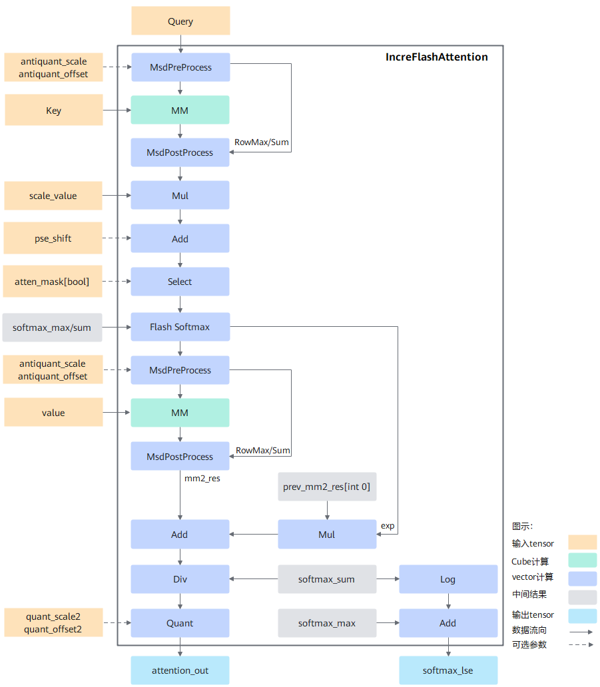

声明：本文使用[Creative Commons License version 4.0](https://creativecommons.org/licenses/by/4.0/legalcode)许可协议，转载、引用或修改等操作请遵循此许可协议。

# IFA算子设计介绍

为不断优化提升增量推理性能，提出支持增量推理的IncreFlashAttention融合算子需求。

增量推理相对于全量推理，主要有如下差异：

1. 输入数据特点是query 的S轴固定为1；
2. Key和Value是经过kv cache后，将之前推理过的state信息叠加在一起，每个Batch对应的S轴的实际长度可能不一样，输入的数据时经过padding后的固定长度数据。

## 实现原理

图1 计算流程图：




按照flashAttention正向计算流程实现，整体计算流程如下：

1. query与转置后的key做matmul计算后得到最初步的attention_score，然后与位置编码pse相加后再乘以缩放系数scale_value。此时的结果通过atten_mask进行select操作，将atten_mask中为true的位置进行遮蔽，得到结果masked_attention_score，即atten_mask中为true的位置在select后结果为负的极小值，经过softmax计算之后变成0从而达到遮蔽效果。

2. 为了实现FlashAttention加速算法，使用FlashSoftmax操作对masked_attention_score进行运算，用以代替原公式中的softmax运算，而后将结果与value做matmul运算。由于FlashSoftmax操作对masked_attention_score的Skv(输入key、value的sequence length)方向进行了切分，故实现过程中存在一个刷新流程，具体如下：

   1. 每次FlashSoftmax计算只对切分后的一个SkvSplit（SkvSplit是针对Skv轴进行切分之后的序列长度的简称）进行操作，并从第二次循环开始记录exp，其中 i 表示Skv切分后的循环变量，针对exp的i是从1开始 ，exp的计算公式如下：
      $$
      exp[i] = e^{max_{i - 1} - max_{i}}
      $$

   2. 从i = 1开始，需要增加Mul和Add操作，即将上一次的MM[PV]的结果和当前exp相乘，相乘完的结果和本次MM[PV]的结果相加得到的结果保存到GM中。以此类推，遍历Skv计算完成。

   3. 由于FlashSoftmax计算中的除sum被后移到输出attention_out之前，因此最后需要将ub中的attention_out按行除以softmax_sum并将最终完整的结果保存到输出内存attention_out(Final)上。

## 模板设计

为了使不同的输入可以复用相同的tiling和流水，采用了模板的方式来实现融合算子，但是不同的输入全部使用同一套模板时又无法达到性能最优和功能泛化，因此需要根据输入shape的特征区分不同的模板来实现。

### 模板类型

1. C+V模板：IFA 基础模板，支持绝大多数输入场景，计算时同时使能VectorCore 和 CubeCore，matmul计算放在CubeCore执行;
2. All-Vector模板：对C+V模板的补充，主流程与C+V模板基本一致，matmul计算由vector实现， 降低Cube启动和CV通信开销，对于部分输入类型有更好的性能表现；支持场景：

- Atlas 推理系列产品（Ascend 310P处理器）中的加速卡：全部使用该模板；
- Atlas A2 训练系列产品：非PA，非GQA，且Q、KV 、Output类型全部为FP16 。

### 计算过程

#### 数据切分

由于硬件buffer大小是有限的，而计算的数据量又是巨大的，无法一次计算完，那么就需要进行tiling切分，shape不同会导致算子的切分轴不同，而算子的切分轴，会影响模板的功能及性能。简单的elewise类算子，往往会将所有的轴fuse成一根轴进行切分，逻辑简单，因此模板也比较单一。而融合算子融合了elewise、broadcast、reduce及matmul等多类场景，功能复杂，为达到较高的性能要求，往往需要根据切分轴进行模板拆分，模板拆分时为了达到性能最优，需要考虑如下几个点：

a. 将核心的数量用满，防止部分核闲置 ；

b. 每一个核心被分配的计算量相对均匀，避免出现某些核计算的数据量过大，其余核在围观的情况；

c. AIC和AIV之间处理的数据量要符合其对应的算力，避免AIC或AIV出现长时间的空闲。 

IFA算子包含B、N2(key和value的N)、G(query_N/kv_N)、S1(query的S)、S2(key和value的S)共5个轴， S1轴固定为1，不参与切分。G轴只在Vector计算时切块， BN2S2 切分逻辑如下：

- 核间：数据外切是为了最大限度的利用多个Core并行工作，通常先按照BN2分核，即将BN2 个 SD块分配到多个核上，每个核计算一定数量的SD块，当BN2小于阈值时（0.4 * 总核数），需再对S2轴进行外切（SplitKV份），  总块数为 BN2 * SplitKv，每个核分配一定数量的子块，当所有子块计算完成后，再进行规约，即FlashDecode流程。

- 核内：由于单core缓存有限，需根据设定的缓存大小，对S2轴或KV子块的S2轴 进行切分，此即flashAttention过程。

#### 主流程

```c
// 单核计算伪码
void compute() {
  loops = blocks_to_compute_of_this_core(); // 当前核需要计算几个数据块
      
  for (i = 0; i < loops; i++) {
    block = get_curr_block(i);
    bidx, nidx, sidx = dims_of_this_block(block);
      
    innerloops = get_inner_loops_of_this_block_by_actual_seq_len(bidx, nidx, sidx); // 数据块实际内切份数 
    q_offset = get_offset_of_query(bidx, nidx);

    softmax_sum = {0};
    softmax_exp = {0};
    softmax_max = {min_float};
      
    for (j = 0; j < innerloops; j++) { // flash attention循环
      kv_offset = get_offset_of_kv_block(j);

      qk_res = matmul(q + qoffset, k + kv_offset);

      qk_res = elementwise(qk_res); // pse, atten-mask

      qk_res, softmax_max, softmax_sum, softmax_exp = softmaxflash(qk_res, softmax_max, softmax_sum);

      res = matmul(qk_res, v + kv_offset);

      prev_res = load_prev_res();
      res += prev_res * softmax_exp;  // flash attention update
      store(res);

      if (j == innerloops - 1) {
        res = div(res, softmax_sum);
        output(res);
      }
    }
  }
}
```

#### FlashDecode

S2轴外切分配到不同的核上完成Attention计算后，对结果进行Reduce操作， 这里总共BN2个 SD 大块，每个core对一个大块中的所有子块进行合并。

```c
// FlashDecoe规约，单核流程
void combine() {
  SyncAll(); // 核间同步，确保所有子块计算完成
  splits = get_real_splits_of_this_block_by_actual_seq_len();
  lse = load_lse_of_this_block();
  scale[0:splits] = exp(lse[i]) / Sum(exp(lse[i]));  // i [0, splits)

  res = {0};
  split_res = load_split_res();
  for (j = 0; j < splits; j++) {
    res += split_res[j] * scale[j];
  }
  output(res);
}
```

#### AntiQuant

IFA  AntiQuant 场景矩阵计算公式 为：
$$
C = A * (B + offset)\times scale
$$
A矩阵为FP16/BF16类型， B矩阵为int8类型。

经典的反量化方案，对整个B矩阵进行反量化操作，需要对矩阵B搬入vector处理，矩阵B的数据量较大，严重影响计算性能。

IFA场景下，A矩阵较小，可以通过变换A矩阵来适配B矩阵，基本流程：

1. 矩阵A进入Vector展开成多行，每行An均用int8 格式存储；
2. 将这些An 打包成新的矩阵 AA 计算 CC = AA * B （按 int8 * int8 = int32来计算）；
3. 对matmul 结果CC进行Reduce操作得到C。

#### PageAttention

Kv block内存不连续，Matmul 针对这种场景提供了回调函数进行B矩阵的拷贝（GM->L1),  IFA 中实现相应的拷贝函数，回调函数在Cube中执行，参数通过GM传递，Vector设置相应的参数后到GM后（确保DCCI）再通知Matmul工作。 

#### GQA

G = queryheadNum / KvHeadNum,  Vector上G轴的切分由当前操作所涉及的输入输出UB大小决定，当G过大，UB缓存不足以一次加载全部数据进行计算，需要在G轴上进行切分：

```c
// GQA vector切G伪码
void process() {
  g = target_ub_size() / column_size;
  if (g > G) {
    g = G;
  }
  process_sub_block(g, column); // sub_block: g * column
}
```

#### UB分配

IFA算子对UB分配进行了简化， 初始化时，将UB按照固定大小进行划分（实际大小参见最新代码）：

| UB块                      | Size      | 使用场景                                                    |
| ------------------------- | --------- | ----------------------------------------------------------- |
| inputQue1                 | 32K       | 从GM加载大块数据（pse， AttenMask等）                       |
| inputQue2                 | 16K       | 从GM加载小块数据                                            |
| outputQue1                | 16K       | 向GM输出大块数据                                            |
| outputQue2                | 8K        | 向GM输出小块数据                                            |
| tmpBuff1                  | 32k       | MM1/MM2结果处理                                             |
| tmpBuff2                  | 32k       | MM1/MM2结果处理                                             |
| tmpBuff3                  | 2k        | MM1/MM2结果处理                                             |
| antiqScaleBuff            | 2k        | 常驻专用内存，保存antiquantScale数据                        |
| antiqOffsetBuff           | 2k        | 常驻专用内存，保存antiquantoffset数据                       |
| qAmaxBuff                 | 2k + 256B | 常驻专用内存：保存伪量化（antiquant）Query预处理 RowMax结果 |
| softmaxResAmaxBuff        | 2k + 256B | 常驻专用内存：保存伪量化 softmaxResult 预处理 RowMax 结果   |
| qRowSumBuff               | 2k + 256B | 常驻专用内存：保存伪量化（antiquant）Query预处理 RowSum结果 |
| softmaxResRowSumBuff      | 2k + 256B | 常驻专用内存：保存伪量化 softmaxResult 预处理 Rowsum结果    |
| softmaxMaxBuff            | 2k        | 常驻专用内存：保存softmaxflashv2接口softmaxMax结果          |
| softmaxExpBuff            | 2k        | 常驻专用内存：保存softmaxflashv2接口softmaxExp结果          |
| softmaxSumBuff            | 2k        | 常驻专用内存：保存softmaxflashv2接口softmaxSum结果          |
| bmm1PageAttentionDataBuff | 64B       | 常驻专用内存：PA场景，组装MM1 回调数据                      |
| bmm2PageAttentionDataBuff | 64B       | 常驻专用内存：PA场景 ，组装MM2 回调数据                     |

#### WorkSpace分配

workspace用于保存算子计算过程中不适合常驻UB的中间数据，IFA算子workspace分配情况如下

|                      |                                                            |                                          |
| -------------------- | ---------------------------------------------------------- | ---------------------------------------- |
| mm1ResGm             | msdIterNum * G * SinnerSize * sizeof(float) * corenum      | 保存Cube MM1 计算输出                    |
| vec1ResGm            | msdIterNum * G * SinnerSize * sizeof (fp16/bf16) * coreNum | 保存Vec1计算过程结果                     |
| mm2ResGm             | msdIterNum * G * D * sizeof(float) * corenum               | 保存Cube MM2 计算输出                    |
| vec2ResGm            | msdIterNum * G * D * sizeof(float) * corenum               | 保存Vec2计算过程结果                     |
| queryPreProcessResGm | msdIterNum * G * D * sizeof(int8) * corenum                | antiquant 场景，保存Query预处理结果      |
| accumOutGm           | B * KvN * G * splitKv * D *  sizeof（float）               | FLASHDecode场景，保存子块的Attention结果 |
| logSumExpGm          | B * KvN * G * splitKv * 8 *  sizeof（float）               | FLASHDecode场景，保存子块LSE结果         |
| bmm1CallBackDataGm   | 64B                                                        | PageAttention场景mm1 计算CV通信附加参数  |
| bmm2CallBackDataGm   | 64B                                                        | PageAttention场景mm2 计算CV通信附加参数  |

- SinnerSize：Kv块内切大小；

- msdIterNum ：默认为 1， Antiquant 场景A矩阵扩展行数 ，高精度模式时为3， 高性能模式为2。


## Tiling设计

### 分核设计

​        Tiling操作的目的是为了找到一种更高效的NPU执行方式，原始的数据量一般是非常大的，没有办法通过一次指令调用就完成所有计算，因此需要将数据量分到多个核上并行计算，且每个核上也需要考虑如何循环计算性能最优，不同的输入可能有不同的最优执行方式，所以需要通过tiling策略决定怎么将数据分配到各个核上进行计算。

如前所述，总块数为 BN2 或 BN2*SplitKv

- 输入：核数 + 块数 +  块负载（通常为每个分块的S轴实际长度）；

- 处理：根据负载值对连续的块进行组合重排，达到核间负载差值最小；

- 输出： blockid数组，每个元素对应一个核的起始blockid，最后附加一个元素等于总块数，前后元素差值为该核处理的块数。


### TilingKey 规划

TilingKey为uint64 类型，通常每个模板参数对应TilingKey中的一个十进制位，部分BOOL类型的模板参数采用组合方式在一个十进制位中表示。

```c++
constexpr uint64_t RecursiveSum() {
  return 0;
}

template <typename T, typename... Args>
constexpr uint64_t RecursiveSum(T templateId, Args... templateIds) {
  return static_cast<uint64_t>(templateId) + 10U * RecursiveSum(templateIds...);
}
constexpr uint64_t IFA_TILINGKEYOFFSET = uint64_t(10000000000000000UL);           // 10^16
constexpr uint64_t IFA_PERF_MODE_TILINGKEYOFFSET = uint64_t(1000000000000000UL);  // 10^15
template <typename... Args>
constexpr uint64_t IFA_GET_TILINGKEY(Args... templateIds) {
  return RecursiveSum(templateIds...);
}

uint64_t baseOffset =
      modeVal * IFA_TILINGKEYOFFSET + (static_cast<uint64_t>(perfMode_)) * IFA_PERF_MODE_TILINGKEYOFFSET;

context_->tilingKey = baseOffset + IFA_GET_TILINGKEY(layoutVal, inputQVal, inputKvVal, outputVal, originVal,
                                                       (paVal + splitKvVal + antiquantModeVal));
```

字段说明：

| 十进制位 | 变量             | 说明                                                         |
| -------- | ---------------- | ------------------------------------------------------------ |
| 0        | layoutVal        | 输入Shape格式，0: BNSD；1:BSH/BSND                           |
| 1        | inputQVal        | query数据类型， 0:FP16;  2: BF16                             |
| 2        | inputKvVal       | KV数据类型，0: FP16；2:BF16;  3:INT8                         |
| 3        | outputVal        | output数据类型，0: FP16； 2:BF16;   3:INT8                   |
| 4        | originVal        | 同inputQval                                                  |
| 5 [bit0] | splitKvVal       | 使能FlashDecode标志，1:enable;  0: disable;                  |
| 5 [bit1] | paVal            | 使能PageAttention标志，1:enable;  0: disable;                |
| 5 [bit2] | antiquantModeVal | 使能PerToken伪量化标记，1:enable;  0: disable;               |
| 6...14   |                  | 预留扩展                                                     |
| 15       | perfMode_        | core 运行模式   0: C1_V2 (CV配比1:2) ； 1：全V； 2 C1_V1（CV配比1:1） |
| 16       | modeVal          | 1：IFA TilingKey Base   2：IFA启用SysPrefix功能              |


